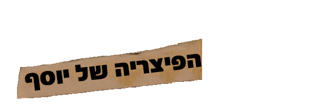

# 🍕 פיצריית שף יוסף

<div align="center">



**פעילות חינוכית אינטראקטיבית בתלת-ממד**

*סיור בעולמה של פיצה איטלקית — מהרחוב עד הצלחת*

[](https://www.electronjs.org/)
[](https://threejs.org/)
[](https://developer.mozilla.org/en-US/docs/Web/JavaScript)

</div>

---

## 📖 על הפרויקט

פיצריית שף יוסף היא פעילות חינוכית אינטראקטיבית בתלת-ממד שנבנתה עבור ילדים ובני נוער. התלמידים מסיירים ברחוב איטלקי, נכנסים למסעדה, מכינים בצק ופיצה, ומשרתים לקוחות שונים — תוך למידה על תזונה, מצרכים, ואבות המזון.

הפעילות כוללת דמויות מונפשות, סרטוני הסבר, מערכת מד-בריאות שמאזנת בין שומנים, פחמימות וחלבונים, ושאלון משוב בסוף.

---

## ✨ תכונות עיקריות

| תכונה | תיאור |
|-------|--------|
| 🌍 **עולם תלת-ממדי** | סצנות Gaussian Splat (`.spz`) ומודלים GLB מונפשים |
| 🎬 **סרטוני הסבר** | סרטונים המשולבים בתוך הסביבה התלת-ממדית |
| 🧑‍🍳 **שלבי משחק** | 7 שלבים מלאים — מהרחוב האיטלקי ועד טקס הכוכבים |
| 🥗 **מד בריאות** | מערכת שמאזנת שומנים, פחמימות וחלבונים בזמן אמת |
| 💬 **דיאלוגים מסונכרנים** | שמע מסונכרן עם טקסט ניתן לדילוג |
| 📋 **שאלון משוב** | שאלון 6 שאלות המשתמש ב-Google Forms |
| 🔄 **עדכונים אוטומטיים** | מנגנון עדכון מובנה דרך GitHub |

---

## 🗺️ מפת השלבים

```
1. הרחוב האיטלקי    ──►  2. פנים המסעדה    ──►  3. הכנת הבצק
                                                        │
        7. המשפחה   ◄──   6. אנטונלה   ◄──   5. אלכס   ◄──   4. הכנת פיצה
              │
              └──►  ⭐ טקס שלושת הכוכבים  ──►  8. עמוד המשוב
```

---

## 🛠️ טכנולוגיות

- **[Electron](https://www.electronjs.org/)** — מעטפת desktop חוצת-פלטפורמות
- **[Three.js](https://threejs.org/)** — מנוע תלת-ממד ב-WebGL
- **[SparkJS / SplatMesh](https://sparkjs.dev/)** — רינדור Gaussian Splat
- **PointerLockControls** — שליטת מצלמה בגוף ראשון
- **Web Audio API** — ניהול קבצי שמע מרובים
- **GitHub API** — מנגנון עדכונים אוטומטיים

---

## 🚀 הפעלה

### דרישות מקדימות

- [Node.js](https://nodejs.org/) גרסה 18 ומעלה
- [npm](https://www.npmjs.com/)

### התקנה

```bash
# שכפל את הפרויקט
git clone https://github.com/snirsnir/chef.git
cd chef

# התקן תלויות
npm install

# הפעל את הפעילות
npm start
```

### בנייה לקובץ הפצה

```bash
npm run dist
```

---

## 🎮 קיצורי מקלדת

| מקש | פעולה |
|-----|--------|
| `W / ↑` | התקדם קדימה |
| `S / ↓` | התקדם אחורה |
| `A / ←` | זוז שמאלה |
| `D / →` | זוז ימינה |
| `עכבר` | הסתכלות |
| `Enter / לחיצה` | המשך דיאלוג |
| `0` | דלג על דיאלוג / סרטון נוכחי |

---

## 🔄 מנגנון עדכונים

הפעילות כוללת מנגנון עדכון אוטומטי מובנה:

1. לחץ על כפתור **"↓ בדוק עדכונים"** בפינה הימנית-תחתונה של המסך הראשי
2. המערכת בודקת את ה-commit האחרון מ-GitHub
3. אם קיים עדכון — לחץ **"הורד והתקן"**
4. הפעילות תורד ותופעל מחדש אוטומטית

> **הערה:** הקובץ `models/food.glb` אינו כלול בעדכון האוטומטי — הוא שוקל 111MB
> וחורג ממגבלת הקובץ של GitHub. הוא מגיע רק עם קובץ ההתקנה.
> גם קבצי התשתית (`main.js`, `preload.js`, `package.json`, `version.json`) אינם מתעדכנים.

---

## 📁 מבנה הפרויקט

```
chef/
├── index.html          # מסך פתיחה
├── street.html         # שלב 1 — הרחוב האיטלקי
├── rest.html           # שלבים 2–7 — המסעדה
├── feedback.html       # שלב 8 — משוב
├── main.js             # תהליך ראשי Electron
├── preload.js          # תפריט ניווט + מנגנון עדכונים
├── audio/              # קבצי שמע MP3
├── models/             # מודלים GLB ו-SPZ
├── images/             # תמונות PNG
├── video/              # סרטוני MP4
└── version.json        # גרסה נוכחית (נוצר לאחר עדכון)
```

---

## 👥 קהל היעד

- ילדים בגילאי 8–14
- קבוצות בית-ספר ומסגרות חינוך
- הורים ומדריכים

---

## 📄 רישיון

פרויקט זה מיועד לשימוש חינוכי.  
© כל הזכויות שמורות — שף יוסף 🍕
